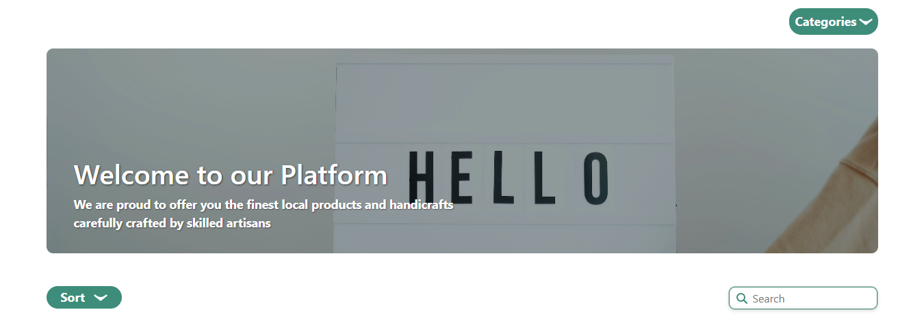
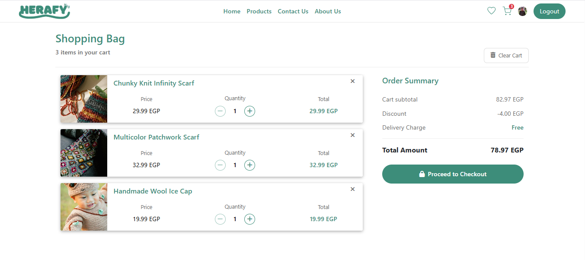
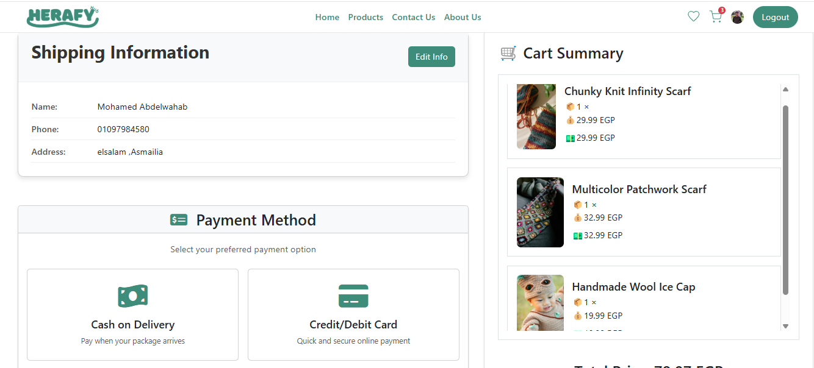
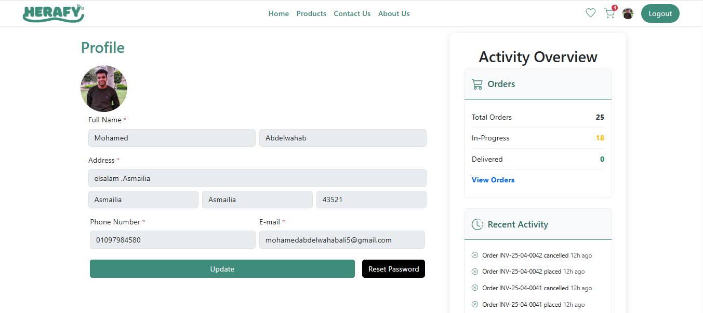

# **Herafy - Angular E-Commerce Platform**

<div align="center">
  
  <p><em>Modern E-Commerce Solution for Seamless Shopping</em></p>
  
  <div>
    <a href="https://angular.io/">
      
    </a>
    <a href="https://www.typescriptlang.org/">
      
    </a>
    <a href="https://rxjs.dev/">
      
    </a>
    <a href="https://www.netlify.com/">
      
    </a>
  </div>
</div>

## **📋 Overview**

**Herafy** is a comprehensive, Angular-based e-commerce platform designed to provide users with an intuitive shopping experience. The application offers essential features like product browsing, shopping cart management, user authentication, favorites system, and secure payment processing via Paymob integration.

### **✨ Live Demo**

[**Try Herafy →**](https://herafy-hub.netlify.app)

---

## **👥 Team Members**

| Name | Role |
|------|------|
| **Mohamed Abdelwahab Ali** | Team Lead |
| **Nehad Ashraf Mohamed** | Developer |
| **Mostafa Bolbol Ramadan** | Developer |
| **Sama Ibrahim Abdelhamid** | Developer |
| **Omar Mohamed Araby** | Developer |

---

## **🚀 Key Features**

### **🔐 User Management**
- **Registration & Login**: Secure account creation and authentication
- **Password Recovery**: Forgot password and reset password functionality
- **User Profiles**: Personal information management and order history

### **🛍️ Shopping Experience**
- **Product Discovery**: Browse products by categories with search and filtering
- **Product Details**: Comprehensive product information with images and specifications
- **Shopping Cart**: Add/remove items, adjust quantities, and persistent cart state
- **Favorites**: Save products for later with one-click add to cart

### **💳 Checkout & Payments**
- **Checkout Flow**: Streamlined checkout process
- **Paymob Integration**: Secure payment processing
- **Order Tracking**: Monitor order status and history

### **🎨 UI/UX**
- **Responsive Design**: Fully responsive across desktop, tablet, and mobile devices
- **Component-Based UI**: Modular interface with reusable components
- **Dynamic Content**: Interactive elements like sliders and category browsers

---

## **🛠️ Technology Stack**

### **Frontend**
- **Framework**: Angular 15+
- **Language**: TypeScript
- **Styling**: CSS/SCSS
- **State Management**: RxJS (Observables & BehaviorSubjects)

### **Backend Integration**
- **Authentication**: JWT (JSON Web Tokens)
- **Payment Processing**: Paymob API
- **Data Storage**: Local storage for cart persistence

### **Development & Deployment**
- **Version Control**: Git
- **Deployment**: Netlify
- **Editor**: VS Code recommended

---

## **📂 Project Structure**

### **Root Directory**
```
herafy/
├── .angular/                   # Angular cache and build files
├── .git/                       # Git repository data
├── .vscode/                    # VS Code editor configuration
├── dist/                       # Build output directory
├── node_modules/               # NPM dependencies
├── public/                     # Public assets
├── src/                        # Source code
├── .editorconfig               # Editor configuration
├── .env                        # Environment variables
├── .gitignore                  # Git ignore configuration
├── angular.json                # Angular CLI configuration
├── package.json                # NPM package definition
├── package-lock.json           # NPM dependency lock
├── README.md                   # Project documentation
├── tsconfig.app.json           # TypeScript config for app
├── tsconfig.json               # Main TypeScript config
├── tsconfig.spec.json          # TypeScript config for tests
└── netlify.toml                # Netlify deployment config
```

### **Component Structure**
```
src/
├── Components/                 # Main component directory
│   ├── about-us/               # About us page
│   ├── cart/                   # Shopping cart functionality
│   ├── cart-item/              # Individual cart item component
│   ├── category-info/          # Category information display
│   ├── checkout/               # Checkout process
│   ├── collection/             # Product collections
│   ├── contact/                # Contact page
│   ├── error/                  # Error handling components
│   ├── favorites/              # User favorites
│   ├── favorites-item/         # Individual favorite item component
│   ├── footer/                 # Site footer
│   ├── forgot-password/        # Password recovery
│   ├── header/                 # Site header/navigation
│   ├── hero/                   # Hero section (landing page)
│   ├── home/                   # Homepage components
│   ├── inspire/                # Inspirational content section
│   ├── login/                  # User authentication
│   ├── order/                  # Order management
│   ├── product-card/           # Product display card
│   ├── product-details/        # Detailed product view
│   ├── products/               # Product browsing
│   ├── products-list/          # Product listing components
│   ├── profile/                # User profile management
│   ├── registration/           # New user registration
│   ├── reset-password/         # Password reset functionality
│   └── slider/                 # Image/content slider
├── Data/                       # Data models and mock data
├── Models/                     # TypeScript interfaces
├── Services/                   # Angular services
├── Utils/                      # Helper functions and utilities
```

### **Core Application Files**
```
src/
├── app.component.css           # Main app styles
├── app.component.html          # Main app template
├── app.component.ts            # Main app component logic
├── app.config.server.ts        # Server-side rendering config
├── app.config.ts               # App configuration
├── app.module.ts               # Main Angular module
├── app.routes.server.ts        # Server-side routing
├── app.routes.ts               # Client-side routing
└── app-routing.module.ts       # Routing module
```

---

## **🔧 Core Services**

| Service | Responsibility | Key Features |
|---------|----------------|-------------|
| **AuthService** | User authentication | Login, registration, password reset |
| **CartService** | Shopping cart management | Add/remove items, calculate totals, persist cart |
| **ProductService** | Product data handling | Fetch products, filter by category, search |
| **UserService** | User profile management | Update profile, order history |
| **PaymentService** | Payment processing | Paymob integration, transaction handling |

---

## **⚙️ Installation & Setup**

### **Prerequisites**
- Node.js v16+ 
- npm v8+
- Angular CLI

### **Development Setup**

1. **Clone the repository**
   ```bash
   git clone https://github.com/yourusername/herafy.git
   cd herafy
   ```

2. **Install dependencies**
   ```bash
   npm install
   ```

3. **Set up environment variables**
   ```bash
   # Rename or copy the example env file
   cp .env.example .env
   
   # Edit the .env file with your API keys and endpoints
   ```

4. **Start the development server**
   ```bash
   ng serve
   ```

5. **Access the application at** [http://localhost:4200](http://localhost:4200)

### **Production Build**

```bash
# Create optimized production build
ng build --configuration production

# The build artifacts will be stored in the dist/ directory
```

### **Deployment to Netlify**

The project is configured for easy deployment to Netlify with `netlify.toml`:

```bash
# Install Netlify CLI
npm install -g netlify-cli

# Deploy to Netlify
netlify deploy
```

You can also set up continuous deployment by connecting your GitHub repository to Netlify.

---

## **🖼️ Application Screenshots**

<div align="center">
  <table>
    <tr>
      <td></td>
      <td></td>
    </tr>
    <tr>
      <td></td>
      <td></td>
    </tr>
    <tr>
      <td></td>
      <td></td>
    </tr>
  </table>
</div>

### **Additional Views**

- **Homepage Views**: Multiple homepage sections (`home1.png`, `home2.png`, `home3.png`)
- **Product Browsing**: Products catalog views (`products1.png`, `products2.png`)
- **User Journey**: Registration (`register.png`), login (`login.png`), and favorites (`favorite.png`)
- **Order Management**: Order listing (`orders.png`) and order details (`orderDetails.png`)

> **Note**: Full set of application screenshots available in the `screenshots` folder.

---

## **📱 Responsive Design**

Herafy is designed with a mobile-first approach, ensuring a seamless shopping experience across all devices:

- **Desktop**: Full-featured experience with optimized layouts
- **Tablet**: Responsive adjustments for medium-sized screens
- **Mobile**: Touch-friendly interfaces with simplified navigation

---

## **🔒 Authentication Flow**

1. **Registration**: Users create accounts with email and password
2. **Email Verification**: Optional email verification process
3. **Login**: Secure authentication with JWT tokens
4. **Password Recovery**: Self-service password reset functionality
5. **Session Management**: Automatic token refresh and secure logout

---

## **🛒 Cart & Checkout Process**

1. **Add to Cart**: Products can be added from various locations
2. **Cart Management**: Review items, adjust quantities, or remove products
3. **Checkout Initiation**: User proceeds to checkout
4. **Shipping & Billing**: User enters address and payment information
5. **Payment Processing**: Integration with Paymob payment gateway
6. **Order Confirmation**: Success page with order details

---

## **⚡ Performance Optimizations**

- **Lazy Loading**: Feature modules loaded on demand
- **RxJS State Management**: Efficient state management using observables
- **Image Optimization**: Responsive images with lazy loading
- **Caching Strategies**: Local storage for persistent data

---

## **🔄 API Integration**

The application connects to backend services for data retrieval and processing:

- **RESTful Endpoints**: Standard API communication
- **Authentication Headers**: JWT tokens for secure requests
- **Error Handling**: Comprehensive error management

---

## **🧪 Testing**

```bash
# Run unit tests
ng test

# Run end-to-end tests
ng e2e
```

---

## **🤝 Contributing**

We welcome contributions to Herafy! Here's how you can help:

1. **Fork the repository**
2. **Create a feature branch**: `git checkout -b feature/amazing-feature`
3. **Make your changes**: Follow our coding standards
4. **Commit your changes**: `git commit -m 'Add some amazing feature'`
5. **Push to the branch**: `git push origin feature/amazing-feature`
6. **Open a pull request**

---

## **📬 Contact & Support**

- **Developer**: [Mohamed Abdelwahab](mailto:your-email@example.com)
- **GitHub**: [github.com/mohamedAbdelwahabali5](https://github.com/mohamedAbdelwahabali5)
- **Website**: [herafy.com](https://herafy-hub.netlify.app)

---

<div align="center">
  <p>
    <strong>Herafy</strong> - Your one-stop shop for modern e-commerce
  </p>
  <p>
    Copyright © 2025 Herafy Team
  </p>
</div>
